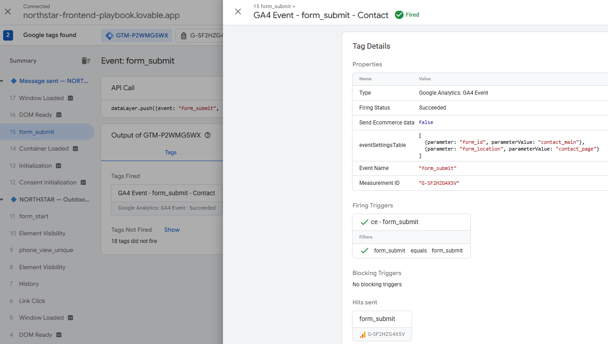
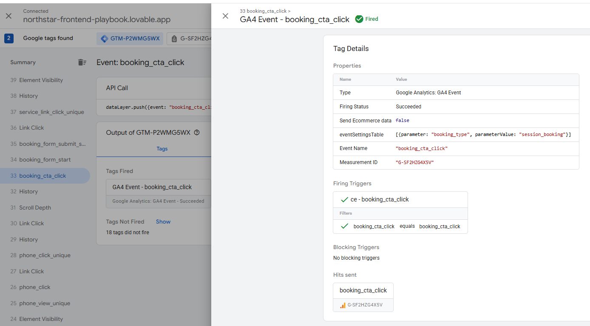
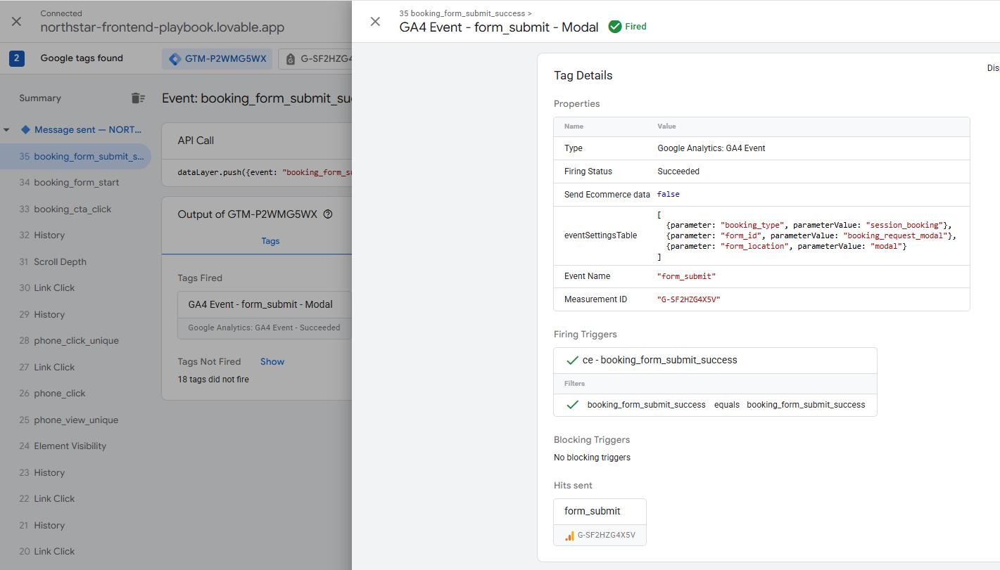
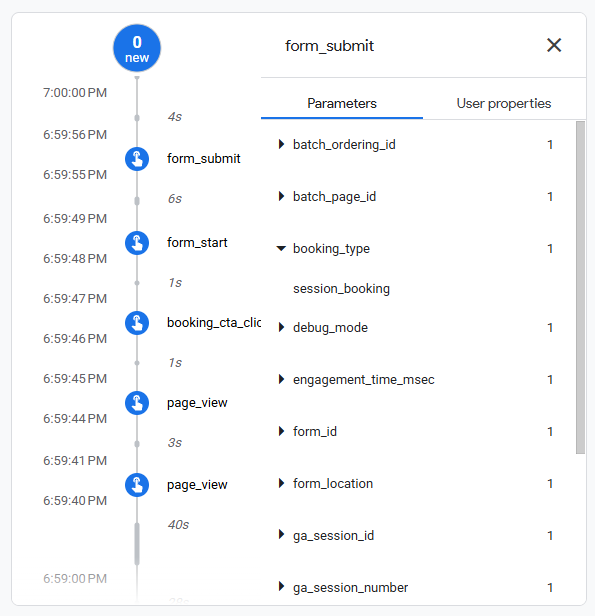
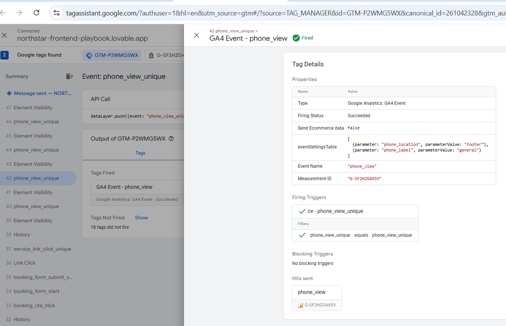
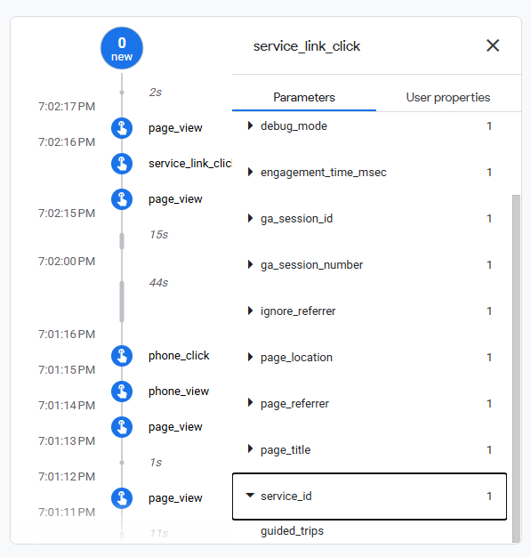

# NORTHSTAR — Inherited-Site Tracking Implementation

GTM + GA4 tracking implementation and QA for an inherited React/SPA website where dedicated analytics instrumentation was not assumed to be available.

The objective was to build reliable measurement using the signals already exposed by the website while documenting the limitations of this approach and identifying cases where frontend instrumentation would provide a stronger architecture.

---

## Scope

The implementation covers four measurement areas.

### Contact Form

* `form_view`
* `form_start`
* `form_submit`

### Phone CTAs

* `phone_view`
* `phone_click`

### Booking Flow

* `booking_cta_click`
* `form_start`
* `form_submit`

### Service Navigation

* `service_link_click`

---

## Implementation Approach

Because dedicated frontend tracking events were not assumed to be available, the implementation uses existing technical signals such as:

* DOM structure;
* link URLs;
* form attributes;
* browser events;
* route context;
* dynamically rendered modal states;
* confirmed success states.

The general architecture is:

```text
Existing browser / DOM / application fact
↓
GTM detection
↓
Semantic normalization
↓
Deduplication
↓
Internal event
↓
GA4
```

---

## Main Techniques

The project uses:

* GTM Element Visibility;
* Just Links triggers;
* Auto-Event Variables;
* Lookup Tables;
* Custom JavaScript variables;
* delegated Custom HTML listeners;
* `MutationObserver`;
* `sessionStorage`;
* internal Data Layer events;
* semantic deduplication.

---

## QA

The implementation was tested with:

* GTM Preview / Tag Assistant;
* GA4 DebugView;
* positive test cases;
* negative test cases;
* duplicate-event tests;
* SPA navigation tests;
* localization tests;
* hard reloads;
* regression testing.

A real duplicate `phone_view` issue was discovered during QA.

Native GTM `Once per element` deduplication operated at DOM-element level, while the measurement specification required deduplication by semantic phone identity:

```text
phone_label + phone_location
```

The architecture was updated to introduce semantic deduplication before the final GA4 event.

All targeted regression tests passed after the fix.

---

## Selected QA Evidence

### GTM Preview — Contact Form Submission

The final Contact submission event is sent only after a valid pending submission is correlated with the confirmed success state.



---

### GTM Preview — Booking Flow

The booking flow tracks intent, meaningful form engagement, and confirmed submission using the semantic `booking_type`.





---

### GA4 DebugView — Booking Funnel

GA4 DebugView confirmed the final sequence:

```text
booking_cta_click
↓
form_start
↓
form_submit
```

with the expected semantic booking context.



---

### GTM Preview — Phone Tracking

Phone interactions are normalized using semantic identity rather than relying only on physical DOM elements.



---

### GA4 DebugView — Service Navigation

Specific service navigation was confirmed in GA4 with the normalized `service_id`.




## Documentation

* [Tracking Specification](01-tracking-spec.md)
* [Implementation Notes](02-implementation-notes.md)
* [QA Report](03-qa-report.md)
* [Project Summary](04-project-summary.md)

---

## Evidence

Supporting screenshots are stored in:

```text
screenshots/
├── implementation/
├── gtm-preview/
└── ga4-debugview/
```

They include:

* GTM container overview;
* GTM Preview validation;
* GA4 DebugView validation.

---

## Architecture Limitation

This implementation intentionally demonstrates how far GTM can reasonably go on an inherited site.

Where tracking would require GTM to reconstruct complex application state or preserve business identity across multiple application steps, frontend instrumentation is considered the preferred solution.

These limitations will be addressed in the next phase of the NORTHSTAR tracking engineering project through a dedicated frontend tracking specification and structured `dataLayer` events.
